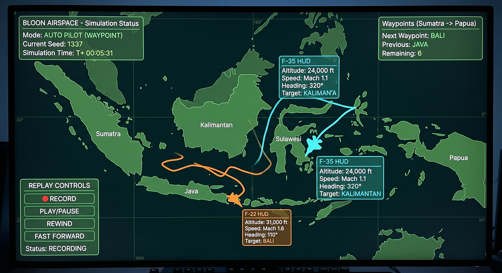

# 🛩️ BLOON AIRSPACE

### *A Completely Unnecessary Aircraft Simulation*
### *by Solitude Labs™*



---

## 📖 What Is This?

**BLOON AIRSPACE** is a flight simulation sandbox where two aircraft — an F-22 and an F-35 — fly around a stylized map of Indonesia for absolutely no reason.

There is:

- no combat
- no weapons
- no targeting
- no radar interception
- no missile simulation
- no operational military data

This is just:

> "Two aircraft flying around Indonesia because BLOON hasn't found them a job yet." 🤣

The simulation is **deterministic**. Given the same seed and the same simulation steps, the same trajectory will be produced every time.

The BLOON Reproducibility Law is intact. 🗿

---

## ✨ Features

### Serious Features — Engineering Layer

- deterministic local RNG
- simple flight model
- waypoint navigation
- trajectory recording
- replay system
- clean architecture
- tests for determinism, replay, waypoint approach, and reset
- no external assets
- no network calls
- no combat systems

### Stupid Features — BLOON Layer

- Brain Status panel
- BLOON LEVEL meter
- Waypoint Reason checkboxes
- `[G] ASK WHY`
- `[M] MAKE IT WORSE`
- CHAOS LEVEL indicator
- PURPOSE / MISSION / STRATEGY one-liners
- BLOON dialogue events
- final report with:

```text
Actual purpose: UNKNOWN
Actual strategy: TIDAK ADA
Brain cells remaining: DEBATABLE
```

---

## 🏗️ Architecture

```text
bloon_airspace/
│
├── main.py                    # Game loop & orchestration
│
├── aircraft/                  # Aircraft state & personality
│   ├── aircraft.py            #   Base class + AircraftState
│   ├── f22.py                 #   F-22: turns good, thinks less
│   └── f35.py                 #   F-35: confused, consistently
│
├── simulation/                # THE SACRED LAYER
│   ├── rng.py                 #   Local deterministic RNG
│   ├── flight.py              #   Flight model
│   ├── waypoint.py            #   Named coordinates
│   └── replay.py              #   Snapshot recording & playback
│
├── world/                     # Fictional geography
│   └── indonesia_map.py       #   Stylized polygons, NOT GIS
│
├── ui/                        # Presentation layer
│   ├── map_screen.py          #   World rendering
│   ├── hud.py                 #   HUD, brain bars, BLOON events
│   └── controls.py            #   Keyboard input
│
└── tests/                     # Serious tests
    └── test_determinism.py
```

---

## 🧠 BLOON Philosophy

```text
The presentation layer can be stupid.
The simulation layer must be disciplined.
The contrast IS the joke. 🗿
```

The HUD is allowed to be chaotic.

The flight model is not.

The RNG is not.

The replay system is not.

The tests are definitely not.

---

## 🚀 Installation

### Requirements

- Python 3.9+
- pygame

```bash
python -m venv .venv
source .venv/bin/activate
pip install -r requirements.txt
```

On Windows:

```bat
python -m venv .venv
.venv\Scripts\activate
pip install -r requirements.txt
```

---

## 🎮 Running

```bash
python main.py
```

Or:

```bash
./run.sh
```

Windows:

```bat
run.bat
```

Custom seed:

```bash
python main.py --seed 42
```

Or:

```bash
BLOON_SEED=42 python main.py
```

---

## 🕹️ Controls

| Key | Action |
|---|---|
| `1` | FREE FLIGHT mode |
| `2` | AUTO PILOT mode |
| `3` | CHAOS MODE |
| `4` | REPLAY mode |
| `↑` / `↓` | Speed up / slow down in FREE mode |
| `←` / `→` | Turn left / right in FREE mode |
| `W` / `S` | Climb / descend in FREE mode |
| `Q` | Select F-22 |
| `E` | Select F-35 |
| `T` | Toggle trail |
| `C` | Clear trail |
| `R` | Reset simulation |
| `SPACE` | Replay play |
| `P` | Replay pause |
| `B` | Replay rewind |
| `F` | Replay fast forward |
| `G` | ASK WHY |
| `M` | MAKE IT WORSE |
| `ESC` | Open BLOON AIRSPACE REPORT |

---

## 🧪 Testing

Run:

```bash
python tests/test_determinism.py
```

Or with pytest:

```bash
pytest tests/ -v
```

Expected:

```text
All BLOON tests passed. Reproducibility law intact. 🗿
```

---

## 🗺️ Map Disclaimer

The Indonesia map in this project is **stylized and fictional**.

It is not:

- navigational
- operational
- geographically accurate
- GIS-derived
- suitable for actual flight

It is only for visual sandbox nonsense.

---

## ⚠️ Important

This is a game/simulation sandbox.

It does **not** implement:

- weapons
- missile guidance
- targeting
- radar evasion
- combat tactics
- interception procedures
- real-world operational routes
- real-world military deployment data

Focus:

```text
flight visualization
+ deterministic simulation
+ replay
+ Pygame
+ BLOON
```

---

## 🏁 Final Screen

After pressing `ESC`, you get:

```text
BLOON AIRSPACE REPORT

F-22 distance: ...
F-35 distance: ...
Waypoints visited: ...
Collisions: 0
Missiles fired: 0
Actual purpose: UNKNOWN
Actual strategy: TIDAK ADA
Brain cells remaining: DEBATABLE

BLOON MISSION COMPLETE
```

Footer:

```text
Two aircraft. One map. Zero reasons.

Solitude Labs™
Engineering More, Flying Nowhere.
```

---

## 🗿 Credits

Made by Solitude Labs™.

Engine: serious.  
Architecture: serious.  
Tests: serious.  
Aircraft: spinning.  
HUD: stupid.  
Destination: not found.  
Programmer: satisfied. 🗿